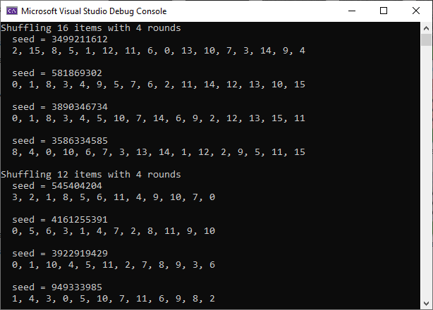
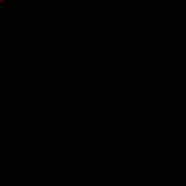

# Constant Time Stateless Shuffling and Grouping

This is code to accompany the blog post at https://www.ea.com/seed/news/constant-time-stateless-shuffling, which talks about using format preserving encryption and some mathematical concepts to shuffle items, or group them together in arbitrary group sizes, in constant time, as well as statelessly. Nothing actually needs to be shuffled or grouped.

The code shows these techniques being used in four demonstrations.

## Shuffling Items

A `StatelessShuffle` object is used to shuffle 16 items with different seeds.  It is also used to shuffle a list with only 12 items to show how to handle non powers of two sized lists.

## Digital Emerge

A `StatelessShuffle` object is used to shuffle the order of pixels to appear on an image, to make it appear over time, pixel by pixel.

## Digital RGB Emerge

A `StatelessGrouping` object is used to group pixels into groups of threes.  When iterating through the pixels, all three members of the groups are queried and the first member has the R channel set, the second member has the G channel set and the third member has the B channel set.  All three members will appear in each position, since the group members are listed relative to the item asking for group members.  In this way, the image appears over time by having each channel appear over time.  Since the first member is the index of the loop, and the first member always gets the red channel set to the correct value, you can see that the red channel fills up from top to bottom, not randomly.

## Improved Digital RGB Emerge

To address this issue, a `StatelessShuffle` object could be used to randomize the loop index, but instead, the `StatelessGrouping` is changed to have 4 members in the group instead of three, and the last 3 members are used as pixel indices to set the R,G and B channels respectively.

## Authors

 
<b>Search for Extraordinary Experiences Division (SEED) - Electronic Arts   http://seed.ea.com</b> 
We are a cross-disciplinary team within EA Worldwide Studios. 
Our mission is to explore, build and help define the future of interactive entertainment.

This code accompanies an article written by Alan Wolfe (<a href="https://blog.demofox.org/">blog.demofox.org</a>) and William Donnelly, at https://www.ea.com/seed/news/constant-time-stateless-shuffling.
